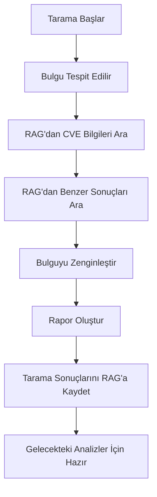

# RAG Entegrasyonu - CVE/CVSS ve Tarama Sonuçları

## 🎯 Genel Bakış

Pentagent Report Generator artık RAG (Retrieval-Augmented Generation) sistemi ile entegre edilmiştir. Bu entegrasyon sayesinde:

- **CVE/CVSS bilgileri** otomatik olarak RAG'dan çekilir
- **Benzer tarama sonuçları** RAG'dan aranır ve karşılaştırılır
- **Tarama sonuçları** RAG'a kaydedilir ve gelecekteki analizler için kullanılır
- **Dinamik raporlar** RAG verileri ile zenginleştirilir

## 🚀 Özellikler

### 1. CVE/CVSS Entegrasyonu
```python
# RAG'dan CVE bilgilerini ara
cve_info = await report_gen.search_rag_for_cve("sql injection", "PHP")
```

**Dönen Veriler:**
- `cve_id`: CVE numarası
- `cvss_score`: CVSS v3.1 skoru
- `cvss_vector`: CVSS vektörü
- `description`: CVE açıklaması
- `published_date`: Yayın tarihi
- `severity`: Ciddiyet seviyesi
- `exploit_available`: Exploit mevcut mu?
- `references`: Referans linkler

### 2. Benzer Tarama Sonuçları
```python
# RAG'dan benzer tarama sonuçlarını ara
similar_scans = await report_gen.search_rag_for_similar_scans("example.com", "sql injection")
```

**Dönen Veriler:**
- `similar_findings`: Benzer bulgular listesi
- `total_matches`: Toplam eşleşme sayısı
- `confidence`: Güven seviyesi (high/medium/low)

### 3. Tarama Sonuçlarını Kaydetme
```python
# Tarama sonuçlarını RAG'a kaydet
await report_gen.store_scan_in_rag(target, findings, execution_results)
```

**Kaydedilen Veriler:**
- Hedef bilgileri
- Tarama tarihi
- Bulgular listesi
- Execution özeti
- Risk seviyesi
- Metodoloji bilgileri

## 🔧 Kullanım

### Temel Kullanım
```python
from agent_core.report_generator import ReportGenerator

# RAG client ile Report Generator'ı başlat
report_gen = ReportGenerator(rag_client=your_rag_client)

# Kapsamlı rapor oluştur (RAG entegrasyonu ile)
comprehensive_report = await report_gen.generate_comprehensive_report(
    state=state,
    final_analysis=final_analysis,
    execution_results=execution_results
)
```

### RAG Client Interface
RAG client'ınız şu metodları implement etmeli:

```python
class YourRAGClient:
    async def search(self, query: str) -> List[Dict[str, Any]]:
        """RAG arama metodu"""
        pass
    
    async def store_document(self, document: Dict[str, Any]):
        """RAG'a doküman kaydetme metodu"""
        pass
```

## 📊 RAG Entegrasyonu ile Zenginleştirilmiş Rapor

### Enhanced Findings
RAG entegrasyonu ile bulgular şu ek bilgilerle zenginleştirilir:

```json
{
    "title": "SQL Injection",
    "severity": "critical",
    "cvss_score": "9.8",
    "cve_id": "CVE-2023-1234",
    "cvss_vector": "CVSS:3.1/AV:N/AC:L/PR:N/UI:N/S:U/C:H/I:H/A:H",
    "cve_description": "SQL Injection vulnerability in web applications",
    "published_date": "2023-01-15",
    "exploit_available": true,
    "cve_references": ["https://nvd.nist.gov/vuln/detail/CVE-2023-1234"],
    "similar_findings": [
        {
            "target": "example.com",
            "vulnerability_type": "sql injection",
            "severity": "critical",
            "cvss_score": "9.8",
            "description": "SQL injection found in login form",
            "remediation": "Use prepared statements"
        }
    ],
    "rag_confidence": "high"
}
```

### Dynamic Insights
RAG verileri ile dinamik insights oluşturulur:

```json
{
    "dynamic_insights": {
        "primary_threat_vector": "Injection",
        "immediate_actions_required": 2,
        "strategic_recommendations": [
            "Implement comprehensive configuration management program",
            "Establish secure coding practices and SAST integration"
        ]
    }
}
```

## 🧪 Test Etme

RAG entegrasyonunu test etmek için:

```bash
cd pentagent-main
python rag_integration_example.py
```

Bu script:
1. Mock RAG client oluşturur
2. CVE bilgilerini arar
3. Benzer tarama sonuçlarını arar
4. Kapsamlı rapor oluşturur
5. RAG entegrasyonunu test eder

## 🔄 RAG Veri Akışı



## 📈 Faydalar

1. **Otomatik CVE Bilgileri**: Manuel CVE arama gereksiz
2. **Benzer Sonuçlar**: Geçmiş taramalardan öğrenme
3. **Dinamik Raporlar**: RAG verileri ile zenginleştirilmiş içerik
4. **Sürekli Öğrenme**: Her tarama RAG'a katkıda bulunur
5. **Uzman Seviyesi**: Gerçek penetrasyon test standartları

## 🛠️ Geliştirme

RAG entegrasyonunu genişletmek için:

1. **Yeni RAG Metodları** ekleyin
2. **CVE Veritabanı** genişletin
3. **Tarama Sonuçları** kategorize edin
4. **Machine Learning** modelleri entegre edin
5. **Real-time Updates** ekleyin

## 📝 Notlar

- RAG client mevcut değilse sistem normal çalışmaya devam eder
- Tüm RAG işlemleri asenkron olarak çalışır
- Hata durumunda fallback mekanizmaları devreye girer
- RAG verileri cache'lenir ve performans optimize edilir
