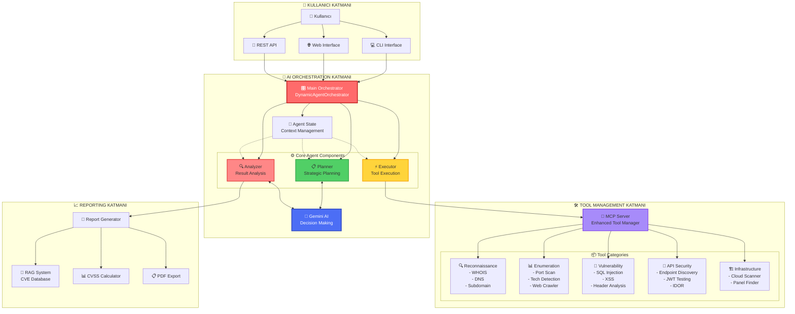
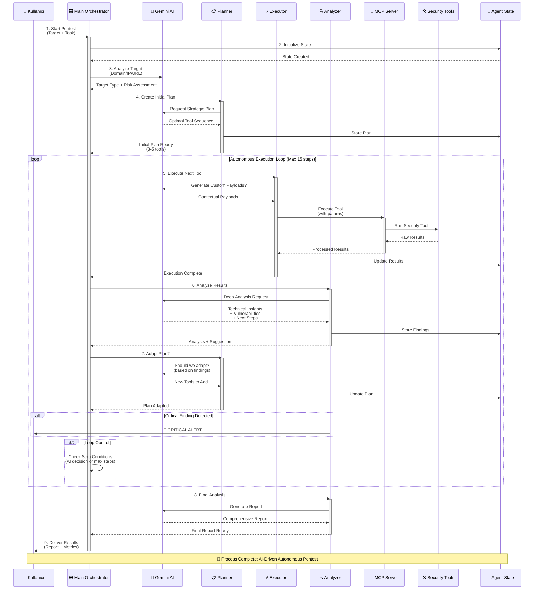
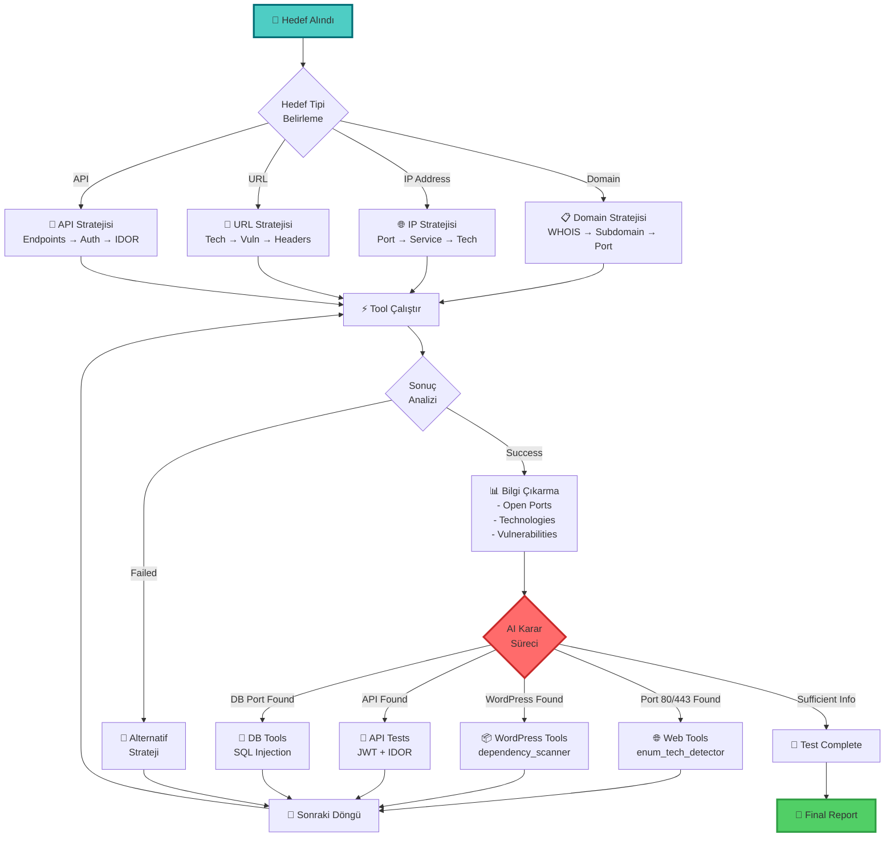
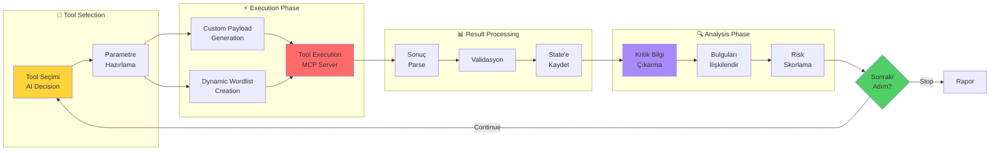
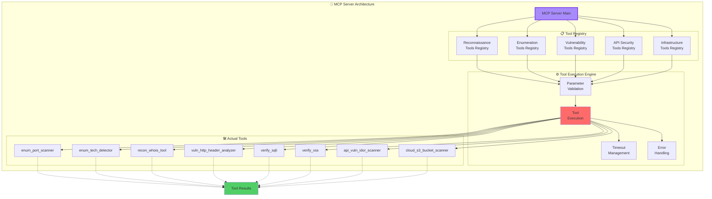
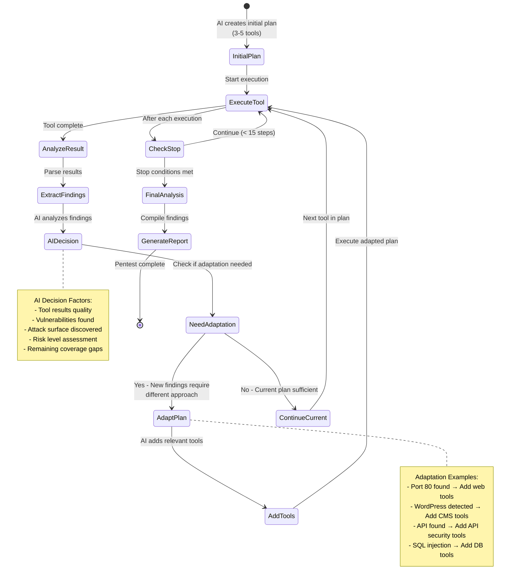
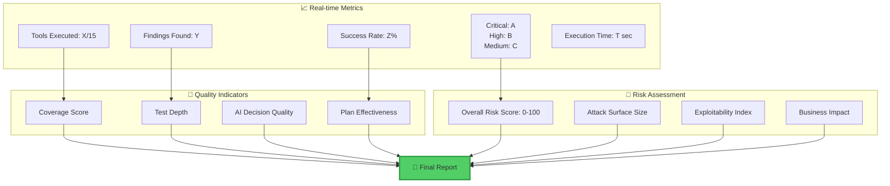

# 🔐 PentAgent AI Tabanlı Penetrasyon Test Workflow Şeması

## 📊 Genel Mimari ve İşleyiş Akışı



## 🔄 Detaylı İşleyiş Akışı (Adım Adım)



## 🧠 AI Karar Verme Süreci



## 🔧 Tool Execution Pipeline



## 📦 MCP Server Tool Management



## 🎯 Dynamic Plan Adaptation Flow



## 📊 Pentest Süreç Metrikleri



## 🔄 Tool Kategorileri ve İşlevleri

### 🔍 Reconnaissance Tools
- **rec_whois_tool**: Domain sahiplik bilgileri, DNS sunucuları
- **recon_dns_analyzer**: DNS kayıtları, MX, TXT records
- **recon_passive_subfinder**: Pasif subdomain keşfi (Certificate Transparency)
- **rec_intel_historical_analyzer**: Wayback Machine, historical data
- **rec_intel_code_scanner**: GitHub/GitLab kod sızıntıları

### 📊 Enumeration Tools
- **enum_port_scanner**: TCP/UDP port tarama, servis tespiti
- **enum_tech_detector**: Web teknolojileri, framework, CMS
- **enum_web_crawler**: Web sitesi yapısı, link keşfi
- **enum_directory_bruteforce**: Gizli dizin/dosya keşfi
- **enum_firewall_detector**: WAF/IDS/IPS tespiti
- **enum_subdomain_bruteforcer**: Aktif subdomain bruteforce

### 🚨 Vulnerability Assessment Tools
- **vuln_http_header_analyzer**: Güvenlik başlıkları (HSTS, CSP, X-Frame)
- **vuln_ssl_tls_analyzer**: SSL/TLS zafiyetleri, cipher suites
- **verify_sqli**: SQL Injection testi (boolean, time-based)
- **verify_xss**: Cross-Site Scripting testi (reflected, stored, DOM)
- **verify_lfi**: Local File Inclusion testi
- **vuln_idor_tester**: Insecure Direct Object Reference
- **vul_depency_scanner**: Third-party kütüphane zafiyetleri

### 🎯 API Security Tools
- **api_finder_active**: API endpoint keşfi
- **api_vuln_idor_scanner**: API IDOR zafiyetleri
- **api_vuln_jwt_tester**: JWT token güvenlik testleri

### 🏗️ Infrastructure Tools
- **infra_exposed_panels_finder**: Admin panel keşfi
- **cloud_s3_bucket_scanner**: AWS S3 bucket güvenliği
- **recon_origin_ip_finder**: CDN bypass, origin IP keşfi

## 🧠 AI Entegrasyonu Detayları

### 1. **Planner AI Prompts**
```
- Target classification (Domain/IP/URL/API)
- Risk assessment (Government/Educational/Commercial)
- Strategic tool selection
- Attack surface mapping
- Test coverage optimization
```

### 2. **Analyzer AI Prompts**
```
- Result interpretation
- Vulnerability categorization (OWASP Top 10)
- CVSS scoring
- Attack chain identification
- Next action recommendation
```

### 3. **Executor AI Enhancement**
```
- Custom payload generation
- WAF bypass techniques
- Dynamic wordlist creation
- Context-aware testing
```

## 📝 Önemli Notlar

### ✅ Sistem Özellikleri
1. **Tamamen Otonom**: Kullanıcı müdahalesi gerektirmez
2. **AI Destekli**: Gemini 2.0 Flash ile stratejik kararlar
3. **Dinamik Adaptasyon**: Sonuçlara göre plan değişir
4. **Kapsamlı Analiz**: OWASP Top 10, CVSS skorlama
5. **Güvenli Tasarım**: Sadece tespit odaklı, sömürü yok

### ⚠️ Güvenlik Kontrolleri
1. **Tehlikeli Tool Filtresi**: RCE, privilege escalation engellendi
2. **Loop Prevention**: Aynı tool tekrar engellidir
3. **Timeout Management**: Her tool için maksimum süre
4. **Rate Limiting**: API abuse önleme
5. **Etik Testler**: Sadece bilgi toplama ve tespit

### 🎯 AI Karar Mantığı
1. **Context-Aware**: Önceki sonuçları dikkate alır
2. **Risk-Based**: Kritik bulgulara öncelik verir
3. **Efficient**: Gereksiz tool'ları atlar
4. **Adaptive**: Her hedef için farklı strateji
5. **Learning**: Sonuçlardan öğrenir ve adapte olur

---

**🔐 PentAgent**: AI-Powered Autonomous Penetration Testing Platform
**📅 Version**: 2.0.0-dynamic
**🤖 AI Model**: Google Gemini 2.0 Flash

